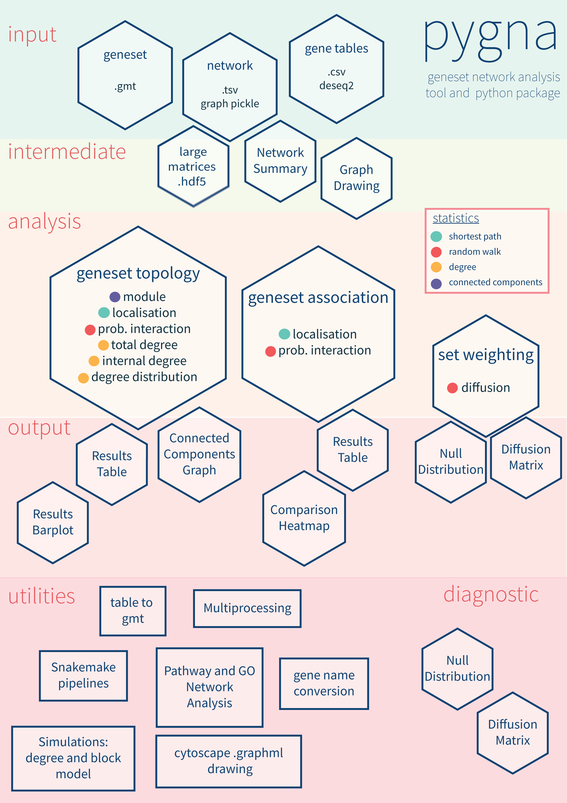

# PyGNA: a Python framework for geneset network analysis

Current version: 0.4.2-dev

PyGNA is a unified framework for network analysis of high-throughput experiment results. It can be used both as a standalone command line application or it can be included as a package in your own python code. 

For an overview of PyGNA functionalities check the infographic below, otherwise dive into the [Getting started](#getting-started) guide. For the complete API check the official [Documentation](Documentation)

## Installation

The easiest and fastest way to install `pygna` using `conda`:

    $ conda install -c stracquadaniolab -c bioconda -c conda-forge pygna

Alternatively you can install it through `pip`:

    $ pip install pygna

Please note, that `pip` will not install non Python requirements.

## Getting started

A typical `pygna` analysis consists of 3 steps:

1. step 1.
2. step 2.
3. step 3.

### Example

Running `pygna` on this input as follows:

    $ pygna step-1
    $ pygna step-2
    $ pygna step-3

## Documentation

The official documentation for `pygna` can be found on [readthedocs](https://pygna.readthedocs.io/).

## Authors

- Viola Fanfani (v.fanfani@sms.ed.ac.uk): lead developer.
- Giovanni Stracquadanio (giovanni.stracquadanio@ed.ac.uk)

## Citation

A unified framework for geneset network analysis.
Viola Fanfani and  Giovanni Stracquadanio
bioRxiv XX; doi: XX

## Issues

Please post an issue to report a bug or request new features.
